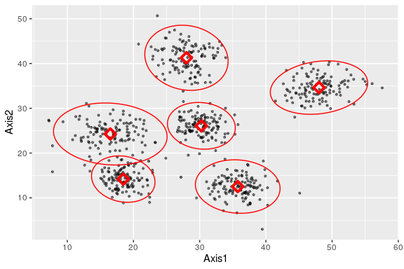

# RobustEM


The goal of RobustEM is to carry out clustering on high dimensional
points using expectation-maximization algorithm which is robust against
outliers. To install the package, make sure you have `devtools` package
loaded and type `install_github("mkbwang/RobustEM", ref="main")`.

## Usage Example

``` r
library(RobustEM)
```

The example here simulate 720 points belonging to 6 clusters. Each
cluster has 120 points. All the points have two dimensions. All the
clusters have approximately 6% of points as outliers. The outliers are
generated here as having the same mean but a covariance matrix with much
larger elements. This customized function `simMultGauss` not only
generates the data points but also includes detailed cluster information
(mean and covariance of each cluster).

``` r
set.seed(22)
sim_info <- simMultGauss(n = 120, d = 2, cluster = 6, out_perc = 0.03, out_mag = 4)
```

We can use function `robustEM` to cluster the points.

``` r
result <- robustEM(sim_info[["simdata"]], cluster = 6)
```

I have written a customized summary function to summarize the cluster
mean and the number of points in each cluster.

``` r
summary(result)
#> $`Cluster Point Count`
#> point_cluster
#>   1   2   3   4   5   6 
#> 121 119 119 121 120 120 
#> 
#> $`Cluster Mean`
#>            V1       V2
#> [1,] 16.49681 24.26420
#> [2,] 18.45567 14.19157
#> [3,] 35.74641 12.52521
#> [4,] 30.25588 26.08767
#> [5,] 27.99846 41.28102
#> [6,] 48.01971 34.62843
```

``` r
plot(result)
```


